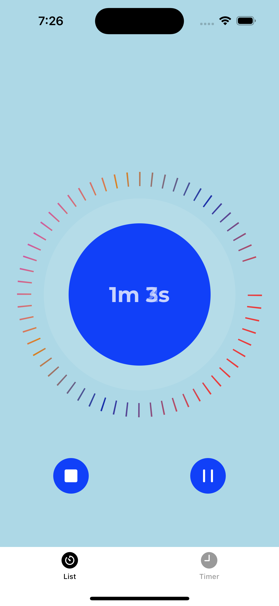
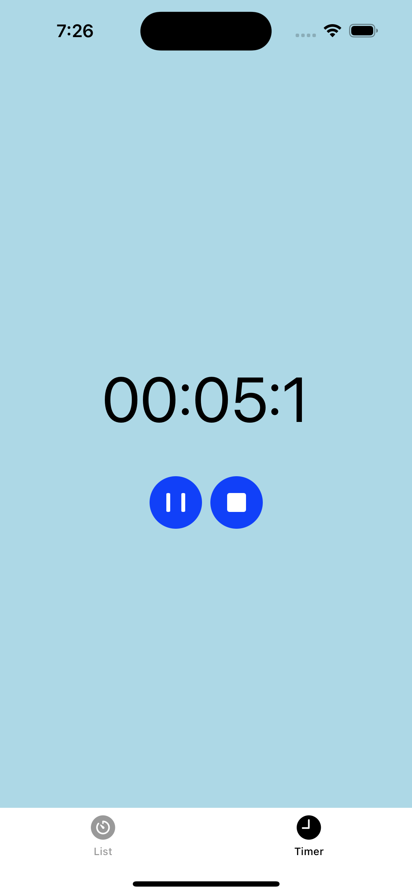
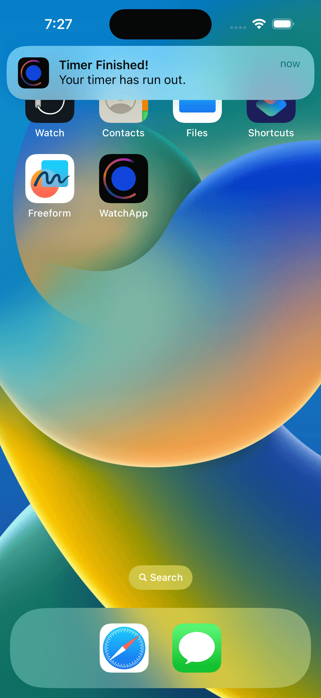

# WatchApp - Timer and Stopwatch App

## Description

WatchApp is a simple iOS app that provides both Timer and Stopwatch functionality. It allows users to set timers and use a stopwatch to track elapsed time accurately. The app is built using SwiftUI and Combine framework, making it a great example of modern iOS app development.

## Features

- Timer functionality: Users can set timers and receive a notification when the time runs out.
- Stopwatch functionality: Users can use the stopwatch to track elapsed time with precision.
- Clean and intuitive user interface: The app follows the iOS design guidelines, providing a seamless user experience.

## Screenshots

    
    
    

## Installation

1. Clone the repository to your local machine.
2. Open the project in Xcode.
3. Build and run the app on your iOS device or simulator.

## How to Use

### Timer Functionality

1. Open the app and go to the Timer tab.
2. Tap on the "Set Timer" button to display the time picker.
3. Select the desired time by scrolling the picker wheels.
4. Tap the "Start" button to start the timer.
5. The timer will count down, and you'll receive a notification when the time runs out.

### Stopwatch Functionality

1. Go to the Stopwatch tab.
2. Tap the "Start" button to begin the stopwatch.
3. The stopwatch will start counting up, tracking elapsed time.
4. Tap the "Stop" button to pause the stopwatch.
5. Tap the "Reset" button to reset the stopwatch to zero.

## Dependencies

- SwiftUI: Used to create the user interface in a declarative way.
- Combine: Utilized for handling asynchronous tasks, such as timers and notifications.
- UserNotifications: Used to display local push notifications when the timer runs out.

## Requirements

- iOS 14.0 or later
- Xcode 12.0 or later

## Acknowledgments

- Special thanks to https://github.com/sameersyd as he already has written such an app, so I could get inspired by his code. 

## License

This project is licensed under the MIT License.

## Contact

For any inquiries or questions, please contact me -> [thomas.altenburger@hotmail.com](mailto:thomas.altenburger@hotmail.com).